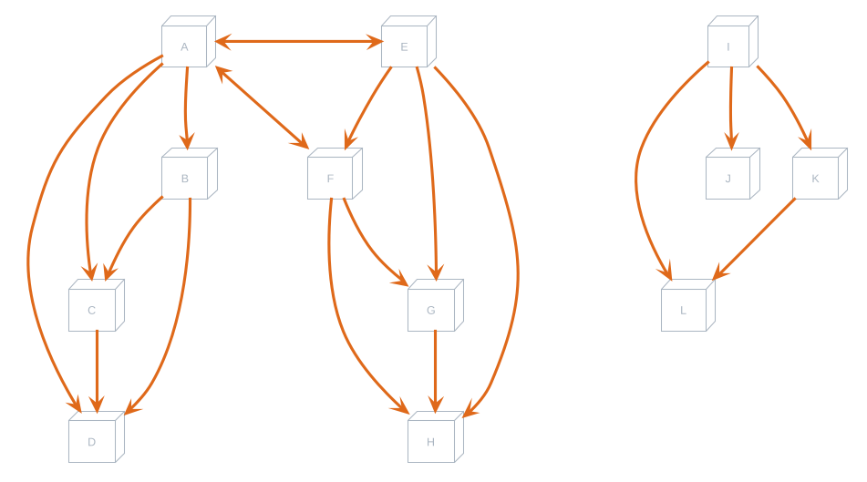

# Table of Contents

1.  [Zeitplan-libs](#org1d58634)
    1.  [Schedule](#orgc0f3ab0)
        1.  [Data](#org5d30300)
        2.  [Compute Windows](#orge2d4b2e)
        3.  [Setup](#org781df9d)
        4.  [Schedule Meetings](#orgad4330a)

# Zeitplan-libs

The core of this project exists within the `zeitplan-libs` project. It contains all of the logic for scheduling meetings.

## Schedule

    pub struct Schedule {
        meetings: Vec<Meeting<N>>,
        availability: Vec<TimeRange<N>>,
    }

### Data

`schedule.rs` contains the `Schedule` type. It accepts a list of `meetings`, and a list of times representing the `availability`. The `availability` represents times which meetings are to be scheduled within. Meetings contain blockedtimes which represents times that meetings can **not** be scheduled. This is so that - after initial setup - the `availability` is the only variable that needs to be modified.

### [Compute Windows](zeitplan-libs/src/schedule.rs)

The `compute_windows` function is designed for computing the number of checks that will need to be made to gurantee that a solution is found.

1.  TODO Return BigInt

    Currently, it returns a usize, but this is not large enough for most cases. The return type needs to eventually be changed at compile time to something like a BigInt or sufficiently large type.

### [Setup](zeitplan-libs/src/schedule.rs)

The `setup` function does some initial checks to prepare the schedule for scheduling.

`setup` does a check which can result in a `ValidationError::PigeonHole` error. This is when we can provably check that there are not enough available times to schedule meetings in. This **first** takes times that the meetings can each be scheduled, and only accounts for those times.
Just because we say that all of Friday is avaialble - if no meetings can be scheduled on Friday - it does not count towards the `pigeon holes`.

Each node in the graph represents time that a meeting can be scheduled. A `subset` relationship is any set of times that fits entirely with its parent. An example of this (in the case of a teacher scheduling student lessons) is two students with similar schedules, except one student has more classes than the other. A more likely scenario might also be a meeting with multiple participants would have to be a subset of meeting with each participant individually.

1.  For example

    1.  To verify node `A`:
    
        Collect each `subset` of `A`: `[B, C, D]`
        Find groups of intersections between `[B, C, D]`:
            `B` has subset `C`, and `D` - so group `[B, C, D]` together
        Verify that each group (`[[B, C, D]]`) can be scheduled together (Find minimum span of times, and check that the duration of `B`, `C`, and `D` can fit in the group)
    
    2.  Similar logic exists for verifying node `E`
    
    3.  To verify the Root:
    
        Collect each node: `[A, B, ..., I]`
        Find groups of intersections between `[A, B, ..., I]`:
            `A` has intersection with `E` - so group `[A, E]` together. These nodes have connections forming the group `[A, B, ..., H]`
            `I` has subsets forming group `[I, J, K, L]`
        Verify that each group (`[[A, B, ..., H], [I, J, K, L]]`) can be scheduled together.

2.  TODO Improve the Pigeonhole check <code>[0/4]</code>

    A new idea for checking Pigeonholes vs Pigeons is as follows:
    
    -   [ ] Organize meetings by availability (highest -> lowest)
    -   [ ] Create a graph with a root node
    -   [ ] Process each meeting `x` as follows:
        -   [ ] If `x` &sub; of another meeting in the tree, add it as a child node of that tree
        -   [ ] If the meeting is equivalent to another meeting - add the durations, and do not add the node.
        -   [ ] If the meeting overlaps with another meeting - it should be added as a sibling node
    -   [ ] Check each node in the graph that all of its child node meetings can be scheduled (sum of durations) within the timeframe. This should be done as a DFS - where the duration &ldquo;bubbles up&rdquo; from the leaf nodes.
    
    Things to consider here are that the algorithm becomes increasingly more complex.

3.  Returns

    This function returns a `Vec` of meetings (only the ones which *can* be scheduled)

### [Schedule Meetings](zeitplan-libs/src/schedule.rs)

This is the function that searches for a solution to schedule all meetings within. It begins by calling the `setup` function.

The function then orders meetings from Least Available &rArr; Most Available. We keep track of the `solution` as we process items. For every meeting, we iterate the possible times to schedule, and find a time which does **not** conflict with any other time currently in `solution`. If we are able to do this for every meeting, the solution has been found.

If we are not able to find a time for a given meeting which can fit in the `solution`, we remove the last added meeting and time from the `solution`, and continue iteration where we left off previously.

If the `len` parameter is not `None`, then this condition of removing the previous meeting is counted as a single check. If we reach the end of `len`, a `ValidationError::NoSolutionWithinIteration` result is returned.

If we instead exhaust every arrangement and find no solutions, a `ValidationError::NoSolution` error is returned instead - which indicates that no solution existed.

1.  Parallelism

    If `zeitplan_libs` is compiled with the `rayon` feature, then parallelization is supported when scheduling meetings. This works by shuffling the meetings, and running them through the same steps detailed above. This can occasionally find the solution faster. A separate `per_thread` parameter is used to run these child threads at a potentially lower check rate.

