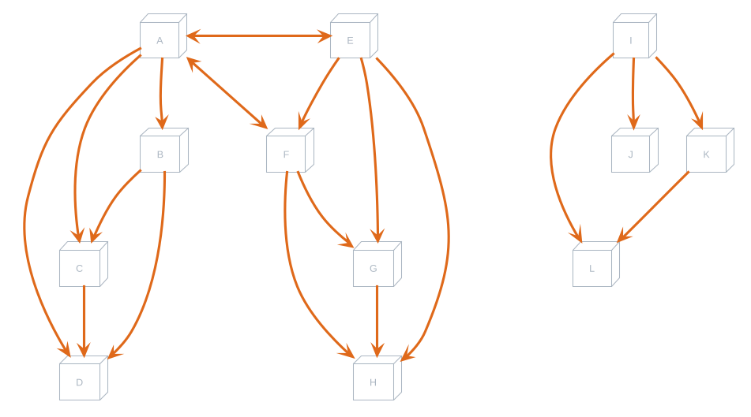
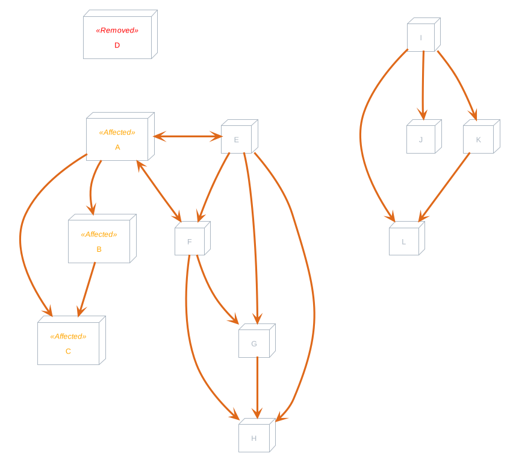
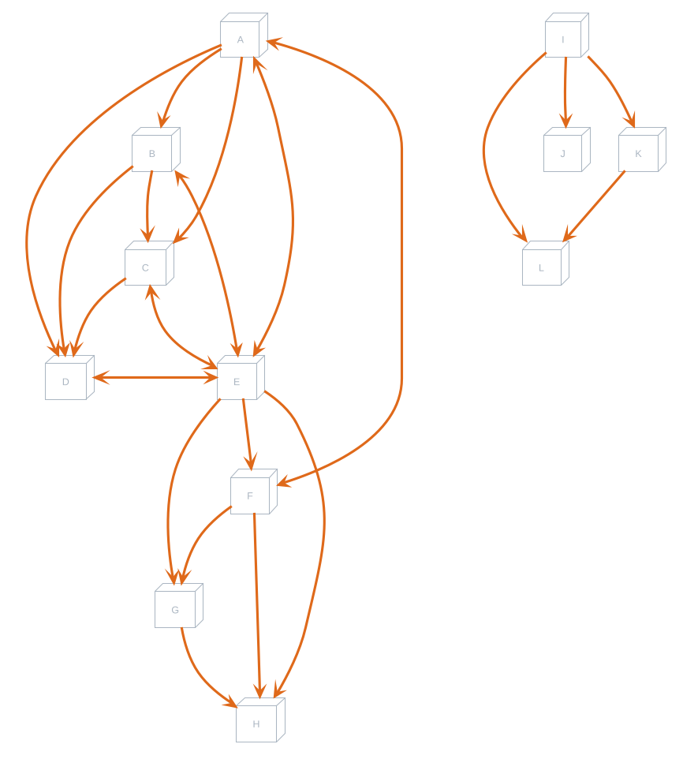
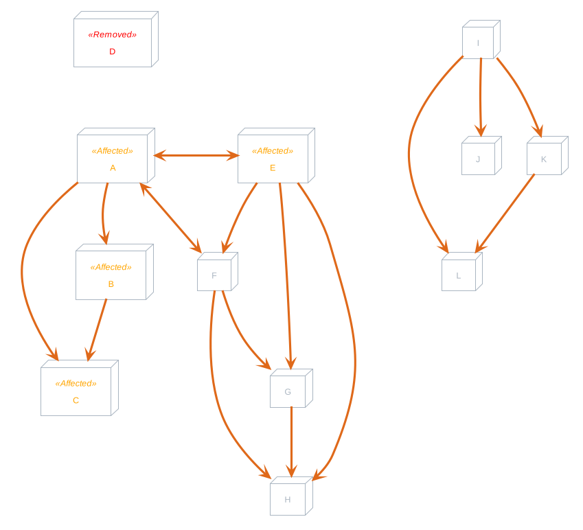
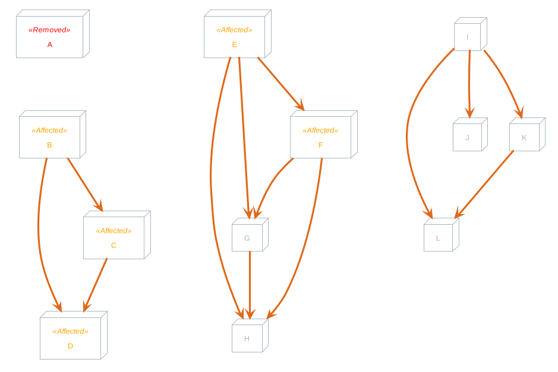

# Table of Contents

1.  [Zeitplan-libs](#org85ca65b)
    1.  [Schedule](#orgdd656a5)
        1.  [Data](#orgfa43c4c)
        2.  [Compute Windows](#org70e9c5f)
    2.  [Setup](#orgde62dc9)
        1.  [Add this check to Setup](#orgcda302e)
    3.  [Schedule Meetings](#orgac3a754)
        1.  [Parallelism](#orgac0ad8f)
        2.  [Update this to use the new graph provided from the new Pigeonhole Check](#org49620a9)

# Zeitplan-libs

The core of this project exists within the `zeitplan-libs` project. It contains all of the logic for scheduling meetings.

## Schedule

    pub struct Schedule {
        meetings: Vec<Meeting<N>>,
        availability: Vec<TimeRange<N>>,
    }

### Data

`schedule.rs` contains the `Schedule` type. It accepts a list of `meetings`, and a list of times representing the `availability`. The `availability` represents times which meetings are to be scheduled within. Meetings contain blockedtimes which represents times that meetings can **not** be scheduled. This is so that - after initial setup - the `availability` is the only variable that needs to be modified.

### [Compute Windows](zeitplan-libs/src/schedule.rs)

The `compute_windows` function is designed for computing the number of checks that will need to be made to gurantee that a solution is found.

1.  TODO Return BigInt

    Currently, it returns a usize, but this is not large enough for most cases. The return type needs to eventually be changed at compile time to something like a BigInt or sufficiently large type.

## [Setup](zeitplan-libs/src/schedule.rs)

The `setup` function does some initial checks to prepare the schedule for scheduling.

`setup` does a check which can result in a `ValidationError::PigeonHole` error. This is when we can prove with a that there are not enough available times to schedule meetings in. This **first** takes times that the meetings can each be scheduled, and only accounts for those times.
Just because we say that all of Friday is avaialble - if no meetings can be scheduled on Friday - it does not count towards the `pigeon holes`.

### TODO Add this check to Setup

Each node in the graph represents time that a meeting can be scheduled. A `subset` relationship is any set of times that fits entirely with its parent. An example of this (in the case of a teacher scheduling student lessons) is two students with similar schedules, except one student has more classes than the other. A more likely scenario might also be a meeting with multiple participants would have to be a subset of meeting with each participant individually.

1.  For example

    1.  To verify node `A`:
    
        Collect each `subset` of `A`: `[B, C, D]`
        Find groups of intersections between `[B, C, D]`:
            `B` has subset `C`, and `D` - so group `[B, C, D]` together
        Verify that each group (`[[B, C, D]]`) can be scheduled together (Find minimum span of times, and check that the duration of `B`, `C`, and `D` can fit in the group)
    
    2.  Similar logic exists for verifying node `E`
    
    3.  To verify the Root:
    
        Collect each node: `[A, B, ..., I]`
        Find groups of intersections between `[A, B, ..., I]`:
            `A` has intersection with `E` - so group `[A, E]` together. These nodes have connections forming the group `[A, B, ..., H]`
            `I` has subsets forming group `[I, J, K, L]`
        Verify that each group (`[[A, B, ..., H], [I, J, K, L]]`) can be scheduled together.
        These groups can also be processed individually.
    
    4.  IDEA I think more needs to be checked.. For each node: Get directly intersecting nodes, and verify that it can be scheduled also:
    
        `A` has intersection with `E` and `F`, and subsets `[B, ..., D]` so group `[A, ..., F]` and verify that they could be scheduled within itself.

2.  TODO Improve the Pigeonhole check <code>[0/4]</code>

    A new idea for checking Pigeonholes vs Pigeons is as follows:
    
    -   [ ] Organize meetings by availability (highest -> lowest)
    -   [ ] Create a graph with a root node
    -   [ ] Process each meeting `x` as follows:
        -   [ ] If `x` &sub; of another meeting in the tree, add it as a child node of that tree
        -   [ ] If the meeting is equivalent to another meeting - add the durations, and do not add the node.
        -   [ ] If the meeting overlaps with another meeting - it should be added as a sibling node
    -   [ ] Check each node in the graph that all of its child node meetings can be scheduled (sum of durations) within the timeframe. This should be done as a DFS - where the duration &ldquo;bubbles up&rdquo; from the leaf nodes.
    
    Things to consider here are that the algorithm becomes increasingly more complex.

3.  Returns

    This function returns a `Vec` of meetings (only the ones which *can* be scheduled)

## [Schedule Meetings](zeitplan-libs/src/schedule.rs)

This is the function that searches for a solution to schedule all meetings within. It begins by calling the `setup` function.

The function then orders meetings from Least Available &rArr; Most Available. We keep track of the `solution` as we process items. For every meeting, we iterate the possible times to schedule, and find a time which does **not** conflict with any other time currently in `solution`. If we are able to do this for every meeting, the solution has been found.

If we are not able to find a time for a given meeting which can fit in the `solution`, we remove the last added meeting and time from the `solution`, and continue iteration where we left off previously.

If the `len` parameter is not `None`, then this condition of removing the previous meeting is counted as a single check. If we reach the end of `len`, a `ValidationError::NoSolutionWithinIteration` result is returned.

If we instead exhaust every arrangement and find no solutions, a `ValidationError::NoSolution` error is returned instead - which indicates that no solution existed.

### Parallelism

If `zeitplan_libs` is compiled with the `rayon` feature, then parallelization is supported when scheduling meetings. This works by shuffling the meetings, and running them through the same steps detailed above. This can occasionally find the solution faster. A separate `per_thread` parameter is used to run these child threads at a potentially lower check rate.

### TODO Update this to use the new graph provided from the new Pigeonhole Check

Process each node individually, and verify that a result can still be scheduled after the node (and new updated times) are removed.
Only check affected nodes (intersecting, and subsets) for verification. Other nodes should not have been affected, and don&rsquo;t need to be checked **(VERIFY THIS)**

Do only nodes that were Affected need to be modified?
Given that the nodes have strictly decreased in size, they wouldn&rsquo;t suddenly intersect with a node it previously didn&rsquo;t. It could, however, remove an **intersection** for one of these affected nodes, if the graph looked like this instead:

Here, removing D would possibly remove the intersections from E:

I think in this case, `E` can only be considered affected IIF `D` caused a time to be removed from `E`. Otherwise, it had no affect on `E`, and would not need to be checked.
I believe the best route would be to process nodes that are subsets first, and don&rsquo;t have any subsets themselves. However, if we processed Node `A` first:

